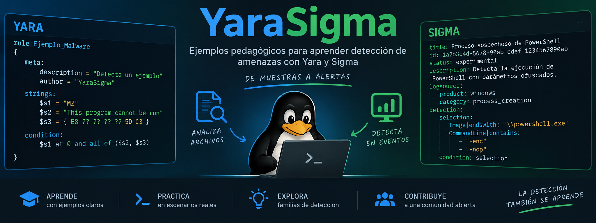

# YaraSigma. Detección de amenazas con YARA y Sigma

Material didáctico y ejecutable para aprender, con un mismo hilo conductor, cómo
funcionan dos de las herramientas más usadas en seguridad defensiva:

- **YARA** busca patrones dentro de **ficheros** y de la **memoria** de procesos.
- **Sigma** describe detecciones sobre **logs** en un formato genérico que se
  traduce al lenguaje de consulta de cada plataforma (Splunk, Elasticsearch,
  SQLite, etc.).

Todo el ejemplo es de laboratorio y completamente inofensivo. El dominio
`c2.malicioso-demo.local` es ficticio y no resuelve.

## La idea central

Una muestra de laboratorio cifra en disco los indicadores de su servidor de mando
y control (C2) y solo los descifra en memoria al ejecutarse. Eso permite ver con
claridad tres cosas:

1. YARA **no** detecta el C2 en el fichero, porque en disco está cifrado con XOR.
2. YARA **sí** lo detecta al escanear la **RAM** del proceso en ejecución.
3. Sigma detecta el mismo ataque en los **logs**, y una única regla se traduce a
   Splunk, Elasticsearch y SQLite.

Mismo binario y misma regla, resultado opuesto según se mire el disco o la
memoria. Esa es la razón por la que el análisis de memoria es imprescindible
frente al malware ofuscado.

## Contenido del repositorio

```
practica_yara_sigma.tex   Documento completo de la práctica (LaTeX)
practica_yara_sigma.pdf   El mismo documento compilado
imageReadme.png           Imagen de portada de este README
yara/
  muestras/
    muestra_demo.c        "Malware" de laboratorio (inofensivo)
    compilar.sh           Compila la muestra
    eicar.com             Fichero de prueba estándar EICAR
    informe_limpio.txt    Control negativo (fichero limpio)
  reglas/
    demo_fichero.yar      Reglas YARA para escanear ficheros
    demo_ram.yar          Reglas YARA para escanear memoria
  ejecutar_yara.sh        Ejecuta toda la demo de YARA
sigma/
  reglas/
    proceso_sospechoso.yml
    beacon_red.yml
  logs/
    eventos.sql           Log sintético de creación de procesos
  ejecutar_sigma.sh       Ejecuta toda la demo de Sigma
```

## Cómo reproducir las demos

```sh
# YARA sobre fichero y memoria
bash yara/ejecutar_yara.sh

# Sigma: conversión a varios backends + consulta real sobre SQLite
bash sigma/ejecutar_sigma.sh
```

### Salida esperada de YARA

La misma regla que falla contra el fichero acierta contra la memoria del proceso:

```
# Contra el FICHERO en disco: sin coincidencias (C2 cifrado)
# Contra la RAM del proceso:
Malware_Demo_En_Memoria 12345
0x...:$dominio: c2.malicioso-demo.local
0x...:$payload: EVIL_PAYLOAD_DEMO_v1
0x...:$url: http://c2.malicioso-demo.local/beacon
```

### Salida esperada de Sigma

Una regla en YAML se traduce a varios lenguajes y detecta los eventos maliciosos
en el log, descartando el ruido benigno:

```
Splunk : Image="*/muestra_demo" OR CommandLine="*c2.malicioso-demo.local*" | table ...
Lucene : Image:*\/muestra_demo OR CommandLine:*c2.malicioso\-demo.local*
SQLite : SELECT * FROM eventos WHERE Image LIKE '%/muestra\_demo' ...
```

## El documento

`practica_yara_sigma.tex` contiene la guía completa con explicaciones y salidas
reales. Se compila con:

```sh
latexmk -pdf practica_yara_sigma.tex
```

## Descarga e instalación

Para reproducir la práctica necesitas **YARA** (línea de comandos), **Sigma**
(a través de `sigma-cli`, que requiere Python 3.8 o superior) y, para las demos,
`gcc` y `sqlite3`. A continuación tienes las instrucciones para Linux y Windows.

### YARA

**Linux (paquete de la distribución)**

```sh
# Debian / Ubuntu
sudo apt update && sudo apt install yara

# Fedora
sudo dnf install yara

# Arch
sudo pacman -S yara
```

**Linux (compilar la última versión desde el código fuente)**

```sh
# Dependencias de compilación (Debian/Ubuntu)
sudo apt install automake libtool make gcc pkg-config flex bison \
                 libssl-dev libjansson-dev libmagic-dev

# Descargar y compilar (sustituye la versión por la última de las releases)
wget https://github.com/VirusTotal/yara/archive/refs/tags/v4.5.8.tar.gz
tar xzf v4.5.8.tar.gz && cd yara-4.5.8
./bootstrap.sh
./configure --enable-magic
make -j"$(nproc)"
sudo make install
sudo ldconfig            # registra la librería compartida
yara --version
```

**Windows**

1. Ve a las *releases* oficiales: <https://github.com/VirusTotal/yara/releases>
2. Descarga el ZIP precompilado para Windows, por ejemplo
   `yara-4.5.8-2298-win64.zip`.
3. Descomprímelo en una carpeta, por ejemplo `C:\yara`. Contiene `yara.exe` y
   `yarac.exe`.
4. Añade esa carpeta al `PATH` (Configuración → Variables de entorno) para poder
   ejecutar `yara` desde cualquier terminal.
5. Comprueba la instalación abriendo PowerShell:

```powershell
yara.exe --version
```

**yara-python (opcional, para usar YARA desde Python en ambos sistemas)**

```sh
pip install yara-python
```

### Sigma (sigma-cli)

Sigma se instala igual en Linux y en Windows mediante `pip`. Se recomienda usar
un **entorno virtual** para no tocar el Python del sistema.

**Linux**

```sh
python3 -m venv .venv
source .venv/bin/activate
pip install --upgrade pip
pip install sigma-cli
```

**Windows (PowerShell)**

```powershell
py -m venv .venv
.\.venv\Scripts\Activate.ps1
pip install --upgrade pip
pip install sigma-cli
```

**Instalar los backends usados en la práctica** (una vez activado el entorno, en
cualquiera de los dos sistemas):

```sh
sigma plugin install sqlite
sigma plugin install splunk
sigma plugin install elasticsearch

# Comprobar
sigma plugin list      # lista los plugins disponibles e instalados
sigma list targets     # lista los backends listos para convertir reglas
```

> Los scripts de este repositorio invocan `.venv/bin/sigma` (en Windows sería
> `.venv\Scripts\sigma`). Si instalas Sigma en el sistema en lugar de en un
> entorno virtual, usa simplemente `sigma`.

### Utilidades adicionales para las demos

- **gcc** (compilar la muestra): en Linux viene con `build-essential`
  (`sudo apt install build-essential`); en Windows puedes usar
  [MSYS2](https://www.msys2.org/) o WSL.
- **sqlite3** (demo de Sigma): en Linux `sudo apt install sqlite3`; en Windows
  descarga los *precompiled binaries* desde <https://www.sqlite.org/download.html>.

## Requisitos (resumen)

- `yara` 4.x en el `PATH`.
- Python 3.8+ con `sigma-cli` y los backends `sqlite`, `splunk` y
  `elasticsearch` (idealmente en un entorno virtual `.venv/`).
- `gcc` para compilar la muestra y `sqlite3` para la demo de Sigma.

## YARA y Sigma, en una tabla

|                        | YARA                                  | Sigma                          |
|------------------------|---------------------------------------|--------------------------------|
| Qué inspecciona        | Ficheros y memoria (bytes)            | Logs y eventos                 |
| Dónde actúa            | Endpoint, forense, sandbox            | SIEM, EDR, plataforma de logs  |
| Formato                | Reglas `.yar` propias                 | YAML genérico traducible       |
| Pregunta que responde  | ¿Este artefacto contiene el patrón?   | ¿Ha ocurrido este evento?      |

Un flujo realista las encadena: Sigma alerta en el SIEM de que un proceso
sospechoso se ejecutó, y a raíz de esa alerta el analista lanza YARA contra la
memoria de ese proceso para confirmar la infección.
